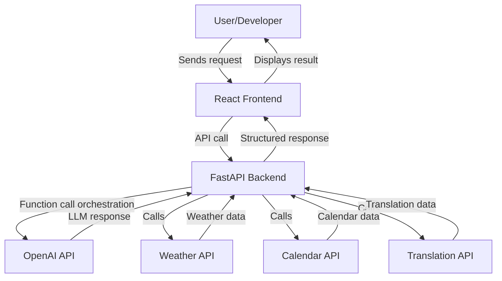

## Developer Flow & Architecture




# OpenAI Function Calling Demo

## Overview
This project is a full-stack, production-ready demo designed to inspire and empower developers to build advanced AI-powered applications using OpenAI's APIs. It showcases best practices for integrating reasoning models, multimodal capabilities, and agent tools in a modern developer workflow.

## Why This Project?
- **Inspirational Demo:** Orchestrates function calling with LLMs, integrating real-world APIs (weather, calendar, translation) and handling structured outputs.
- **Developer Experience:** Features robust error handling, logging, modular code, and reliability patterns to accelerate developer productivity and adoption.
- **Technical Content:** Includes clear code samples, modular architecture, and documentation to educate and inspire the developer community.
- **Extensibility:** Built for easy extension—add new tools, APIs, or agent capabilities with minimal friction. Example functions are provided and new ones can be added in minutes.
- **Responsible AI:** Follows best practices for secure key management, safe API usage, and transparent error reporting.

## Skills Demonstrated
- Full-stack engineering (FastAPI backend, React frontend)
- API integration and orchestration
- LLM function calling and structured output handling
- Logging, monitoring, and error management
- Developer tooling and productivity scripts (setup, testing, environment management)
- Technical documentation and code samples
- Community engagement and feedback-driven improvement

## Project Structure
- `backend/` — FastAPI app, OpenAI integration, modular functions (weather, calendar, translation), logging, and utility scripts
- `frontend/` — React app with a modern UI for interacting with the backend and visualizing results

## Getting Started

### How to Run the Backend (FastAPI)
1. Open a terminal and activate your Python environment.
2. Install dependencies:
	```sh
	pip install -r backend/requirements.txt
	```
3. Start the FastAPI backend:
	```sh
	uvicorn backend.main:app --reload
	```
4. The API will be available at `http://localhost:8000`.

### How to Run the Frontend (React)
1. Open a terminal and navigate to the `frontend/` folder:
	```sh
	cd frontend
	```
2. Install dependencies:
	```sh
	npm install
	```
3. Start the React app:
	```sh
	npm start
	```
4. The frontend will be available at `http://localhost:3000`.

Both apps should be running for full functionality.

This project is designed to:
- Inspire developers with practical, production-ready AI demos and sample apps
- Educate through clear, high-quality technical content, tutorials, and code samples
- Accelerate adoption of OpenAI APIs and best practices
- Foster a vibrant developer ecosystem by making it easy to extend, remix, and build upon
- Demonstrate best practices for developer enablement, error handling, and responsible AI

## Next Steps & Extensions
- Add more sample tools and agent integrations (e.g., multimodal, Codex, custom agents)
- Write tutorials and blog posts based on this repo
- Engage with the developer community for feedback and improvement
- Showcase at developer events and online platforms

## Backend Unit Testing

Unit tests are provided for backend modules to ensure reliability and developer confidence.

**Test Coverage:**
- FastAPI endpoints (e.g., `/health`)
- OpenAI client wrapper
- Utility functions (logging)

**How to Run Tests:**
1. Activate your Python environment and install dependencies:
	```sh
	pip install -r backend/requirements.txt
	pip install pytest
	```
2. From the `function-calling-demo` directory, run:
	```sh
	PYTHONPATH=backend pytest backend/tests
	```
3. All tests in `backend/tests/` will be discovered and executed.

**How to Extend:**
- Add new test files in `backend/tests/` for additional modules or features.
- Use `pytest` and `unittest.mock` for mocking APIs and dependencies.

Unit testing is essential for production readiness and developer enablement. Contributions and new tests are welcome!

---
