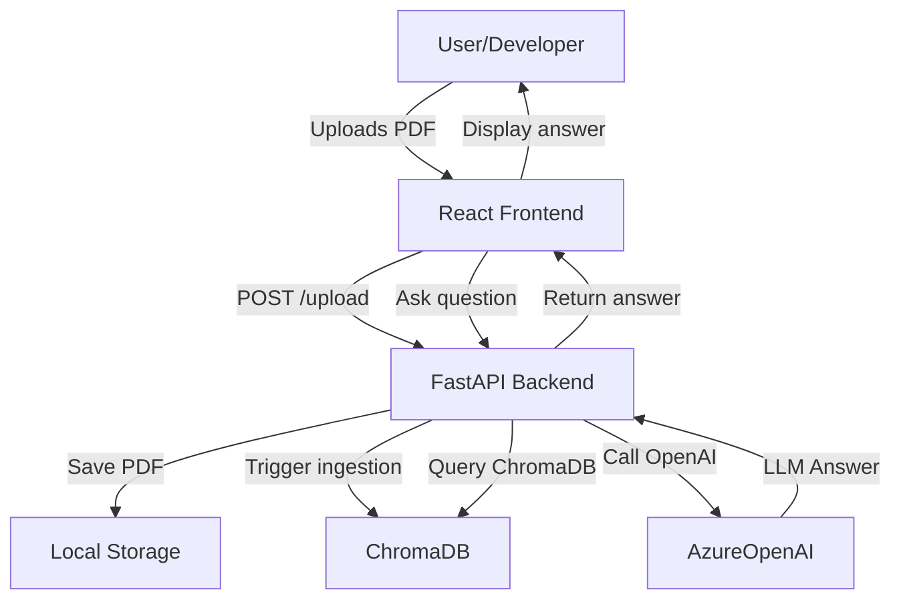

# RAG PDF Demo

## Overview
This project demonstrates Retrieval-Augmented Generation (RAG) on PDFs using OpenAI, FastAPI, ChromaDB, and React. It is designed to showcase advanced developer experience, best practices, and full-stack AI integration for the OpenAI Developer Experience Engineer role.

## Why This Project?
- **Full-stack AI Integration:** Combines FastAPI backend, React frontend, and OpenAI APIs for a seamless developer workflow.
- **Developer Experience:** Features robust error handling, clear UI feedback, modular code, and onboarding documentation.
- **Best Practices:** Demonstrates CORS handling, decoupled ingestion, and scalable architecture.
- **Extensibility:** Easily add new document types, models, or retrieval strategies.
- **Production Readiness:** Follows patterns for reliability, security, and maintainability.

## Skills Demonstrated
- FastAPI backend engineering
- React frontend development
- OpenAI API integration (AzureOpenAI)
- Retrieval-Augmented Generation (RAG) pipeline
- Error handling and user feedback
- Technical documentation and onboarding
- Developer enablement and best practices

## Architecture


## Getting Started

### Backend Setup (FastAPI)
1. Activate your Python environment:
	```sh
	source openai-env/bin/activate
	```
2. Install dependencies:
	```sh
	pip install -r requirements.txt
	```
3. Start the backend:
	```sh
	uvicorn main:app --reload
	```

### Frontend Setup (React)
1. Install dependencies:
	```sh
	cd rag-pdf-demo/frontend
	npm install
	```
2. Start the frontend:
	```sh
	npm start
	```

### Usage
- Upload a PDF using the web UI.
- Ask questions about the uploaded PDFs.
- Answers are generated using RAG and OpenAI.

## Developer Experience Highlights
- **Error Handling:** Clear feedback for upload and query errors in the UI.
- **CORS:** Seamless frontend-backend integration.
- **Modular Code:** Easy to extend and maintain.
- **Documentation:** Step-by-step onboarding for new developers.

## Onboarding Steps
1. Clone the repository and set up Python/Node environments.
2. Configure your OpenAI/Azure credentials in `.env`.
3. Run backend and frontend as described above.
4. Explore the codebase: backend (`main.py`), frontend (`src/App.js`).
5. Review the Mermaid diagram for architecture understanding.
6. Extend the pipeline or UI as needed for your use case.

## Contact & Community
For questions, feedback, or collaboration, open an issue or reach out via GitHub.

---
This project is designed to showcase the skills and developer experience expected of an OpenAI Developer Experience Engineer. It demonstrates full-stack AI integration, robust error handling, and a developer-friendly workflow.