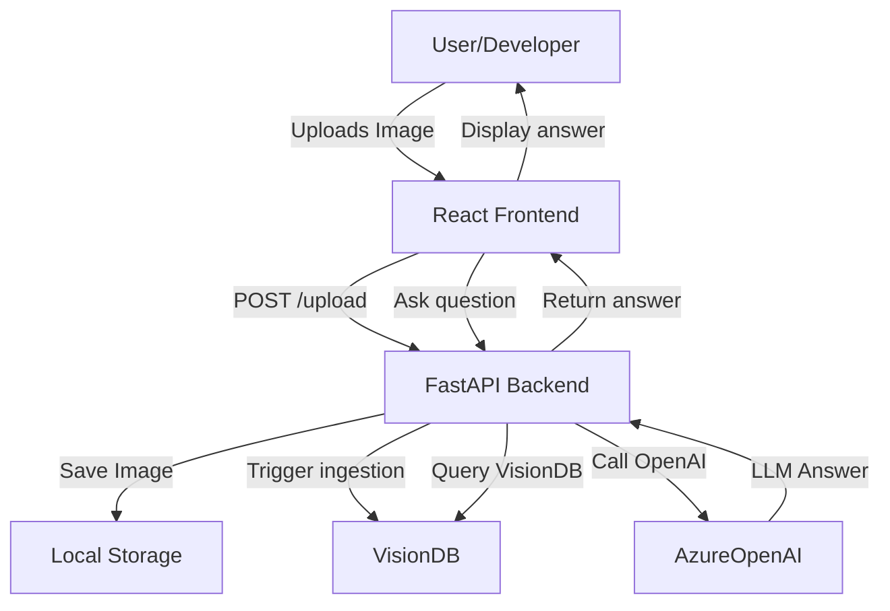

## Ingestion & Vision Process

The ingestion of images and vision documents is an offline, decoupled process. Uploaded images are stored, and you can run ingestion scripts to process new files and make them available for multimodal querying.

### What Ingestion Does
- Stores images and metadata
- Generates embeddings and vision features using OpenAI GPT-4o
- Stores results for retrieval and Q&A

### How to Run Ingestion
1. Place your image(s) in the `backend/data/` folder (upload via UI or manually).
2. Activate your Python environment:
	```sh
	source openai-env/bin/activate
	```
3. Run the ingestion script (if provided):
	```sh
	python backend/ingest.py
	```
4. The script will process all images in `data/`, extract features, embed, and store results for retrieval.

After ingestion, you can query the processed images using the web UI.

# RAG Vision Demo
## Architecture


## Overview
This project demonstrates Retrieval-Augmented Generation (RAG) on images and vision documents using OpenAI GPT-4o, FastAPI, and React. It is designed to showcase advanced developer experience, best practices, and full-stack multimodal AI integration.

## Why This Project?
- **Multimodal AI Integration:** Combines FastAPI backend, React frontend, and OpenAI GPT-4o APIs for seamless developer workflow.
- **Developer Experience:** Features robust error handling, clear UI feedback, modular code, and onboarding documentation.
- **Best Practices:** Demonstrates CORS handling, decoupled ingestion, and scalable architecture.
- **Extensibility:** Easily add new image/document types, models, or retrieval strategies.
- **Production Readiness:** Follows patterns for reliability, security, and maintainability.

## Skills Demonstrated
- FastAPI backend engineering
- React frontend development
- OpenAI GPT-4o API integration (Vision)
- Retrieval-Augmented Generation (RAG) pipeline
- Error handling and user feedback
- Technical documentation and onboarding
- Developer enablement and best practices

## Getting Started

### Backend Setup (FastAPI)
1. Activate your Python environment:
	```sh
	source openai-env/bin/activate
	```
2. Install dependencies:
	```sh
	pip install -r requirements.txt
	```
3. Start the backend:
	```sh
	uvicorn main:app --reload
	```

### Frontend Setup (React)
1. Install dependencies:
	```sh
	cd rag-vision-demo/frontend
	npm install
	```
2. Start the frontend:
	```sh
	npm start
	```

### Usage
- Upload an image using the web UI.
- Ask questions about the uploaded images.
- Answers are generated using multimodal RAG and OpenAI GPT-4o Vision.

## Developer Experience Highlights
- **Error Handling:** Clear feedback for upload and query errors in the UI.
- **CORS:** Seamless frontend-backend integration.
- **Modular Code:** Easy to extend and maintain.
- **Documentation:** Step-by-step onboarding for new developers.

## Onboarding Steps
1. Clone the repository and set up Python/Node environments.
2. Configure your OpenAI/Azure credentials in `.env`.
3. Run backend and frontend as described above.
4. Explore the codebase: backend (`main.py`), frontend (`src/App.js`).
5. Review the Mermaid diagram for architecture understanding.
6. Extend the pipeline or UI as needed for your use case.

## Contact & Community
For questions, feedback, or collaboration, open an issue or reach out via GitHub.

---
This project demonstrates full-stack multimodal AI integration, robust error handling, and a developer-friendly workflow.